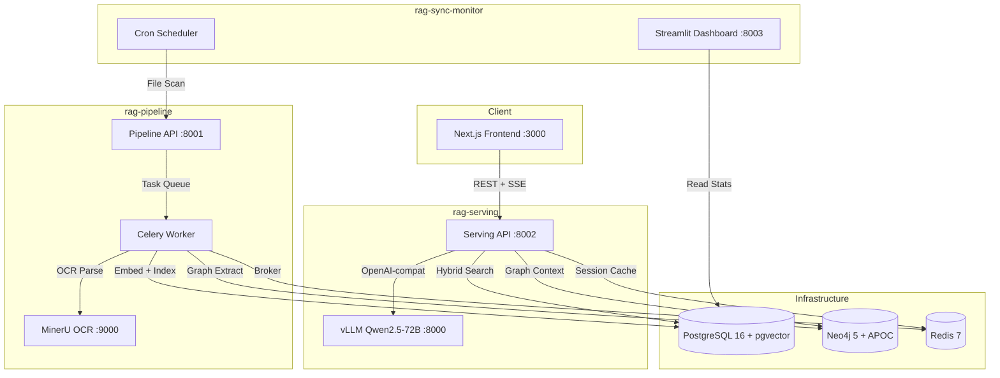
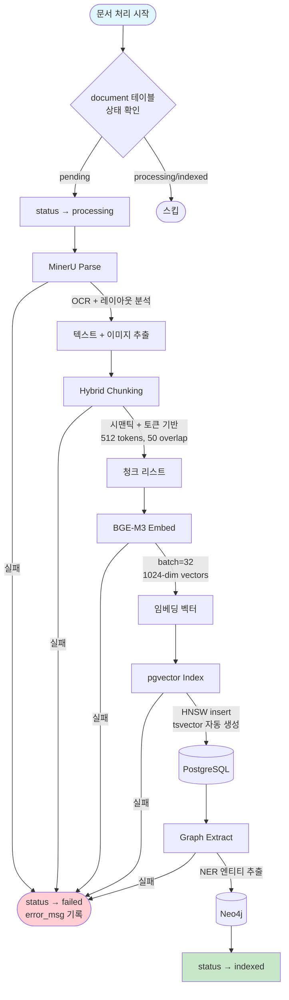
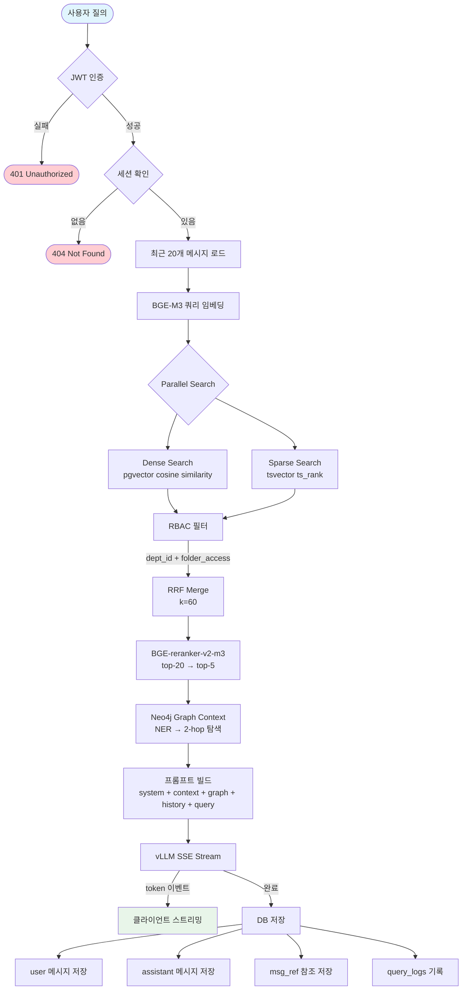
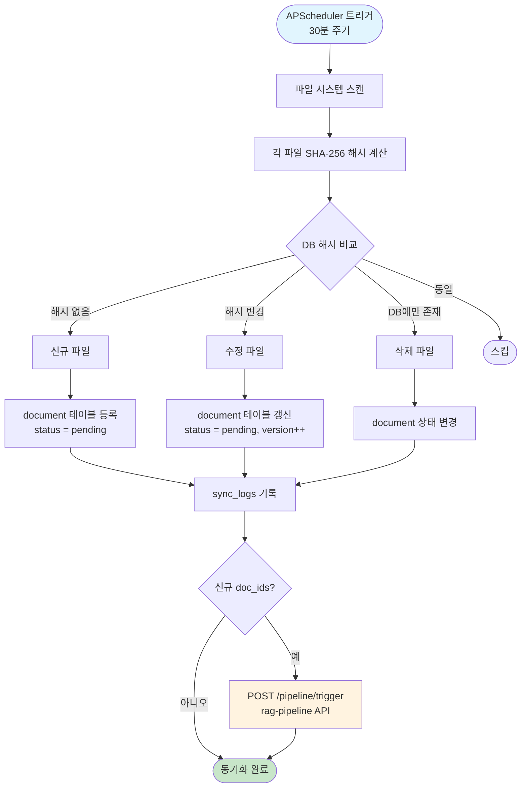

# On-Premise RAG-LLM 사내 AI 어시스턴트 v2

사내 문서(PDF, DOCX, XLSX, PPTX, 이미지)를 기반으로 **ChatGPT/Claude 수준의 UX**를 제공하는 완전 온프레미스 AI 어시스턴트.
외부 API(OpenAI, Anthropic 등) 미사용 — 보안 최우선. 3-프로젝트 모노레포 구조.

---

## 아키텍처



---

## 기술 스택

| 레이어 | 기술 | 비고 |
|--------|------|------|
| Frontend | Next.js 16 (App Router, TypeScript, Tailwind) | 채팅 UI, 로그인, 관리자 |
| Backend | FastAPI (Python 3.11, sync SQLAlchemy) | rag-serving + rag-pipeline |
| LLM | vLLM + Qwen2.5-72B-Instruct-AWQ | OpenAI-compatible API |
| Embedding | BAAI/bge-m3 (1024-dim) | Dense + Sparse 지원 |
| Reranker | BAAI/bge-reranker-v2-m3 | Cross-encoder |
| Vector + RDBMS | PostgreSQL 16 + pgvector (HNSW) + tsvector | Hybrid Search (Dense + Sparse + RRF) |
| Graph DB | Neo4j 5 + APOC | GraphRAG (NER + 2-hop context) |
| Task Queue | Celery + Redis 7 | 비동기 파이프라인 처리 |
| OCR | MinerU (RAG-Anything) | PDF/이미지 파싱 |
| Monitoring | Streamlit | 동기화/처리 대시보드 |
| Container | Docker Compose | 모노레포 오케스트레이션 |

---

## 모노레포 구조

```
llm_again/
├── shared/                          # 공유 모듈
│   ├── sql/init.sql                 #   PostgreSQL DDL (27 테이블)
│   ├── models/
│   │   ├── orm.py                   #   SQLAlchemy ORM 모델
│   │   └── registry.py             #   ML 모델 레지스트리
│   ├── config.py                    #   Pydantic 공통 설정
│   └── db.py                        #   DB 연결 헬퍼
│
├── rag-pipeline/                    # 문서 수집/파싱/임베딩 파이프라인
│   ├── api/main.py                  #   Pipeline API (FastAPI)
│   ├── pipeline/
│   │   ├── scanner.py               #   파일 시스템 스캐너
│   │   ├── parser.py                #   MinerU 파서
│   │   ├── chunker.py               #   Hybrid 청킹
│   │   ├── embedder.py              #   BGE-M3 임베딩
│   │   ├── indexer.py               #   pgvector 인덱싱
│   │   ├── graph_extractor.py       #   Neo4j 엔티티 추출
│   │   └── orchestrator.py          #   파이프라인 오케스트레이터
│   ├── tasks/
│   │   ├── celery_app.py            #   Celery 앱 설정
│   │   └── pipeline_tasks.py        #   비동기 처리 태스크
│   └── config.py                    #   Pipeline 설정
│
├── rag-serving/                     # RAG 질의응답 + 인증 + 관리
│   ├── api/
│   │   ├── main.py                  #   Serving API (FastAPI + CORS)
│   │   ├── routers/
│   │   │   ├── auth.py              #   인증 (JWT login/refresh/logout)
│   │   │   ├── chat.py              #   채팅 (SSE 스트리밍)
│   │   │   └── admin.py             #   관리자 (사용자/문서/설정)
│   │   ├── auth/                    #   JWT + bcrypt 인증 모듈
│   │   └── rag/
│   │       ├── retriever.py         #   Hybrid Search (Dense + Sparse + RRF)
│   │       ├── reranker.py          #   BGE-reranker-v2-m3
│   │       ├── graph_retriever.py   #   Neo4j Graph Context
│   │       └── generator.py         #   vLLM SSE 스트리밍
│   ├── admin/index.html             #   관리자 대시보드 (Vanilla HTML)
│   ├── vllm/start_vllm.sh          #   vLLM 시작 스크립트
│   └── config.py                    #   Serving 설정
│
├── rag-sync-monitor/                # 파일/사용자 동기화 + 모니터링
│   ├── sync/
│   │   ├── file_syncer.py           #   파일 동기화
│   │   ├── user_syncer.py           #   사용자 동기화
│   │   └── change_detector.py       #   변경 감지
│   ├── trigger/
│   │   └── pipeline_trigger.py      #   rag-pipeline API 호출
│   ├── scheduler/cron_sync.py       #   APScheduler 크론
│   └── dashboard/app.py             #   Streamlit 대시보드
│
├── mineru/                          # MinerU OCR 마이크로서비스
│   ├── mineru_api.py                #   FastAPI 파싱 서버
│   └── requirements.txt             #   MinerU 런타임 의존성
│
├── frontend/                        # Next.js 프론트엔드
│   ├── app/                         #   App Router (login, chat, admin)
│   ├── components/                  #   React 컴포넌트
│   └── lib/                         #   API 클라이언트, 인증 상태
│
├── docker-compose.yml               # 루트 오케스트레이션
├── docker-compose.base.yml          # 인프라 서비스 (PG, Neo4j, Redis)
├── Dockerfile.mineru                # MinerU 컨테이너
├── Makefile                         # 편의 명령어
└── .env.example                     # 환경변수 템플릿
```

---

## 포트 매핑

| 서비스 | 컨테이너 | 포트 | 설명 |
|--------|---------|------|------|
| `vllm-server` | rag-vllm | 8000 | vLLM OpenAI-compatible API (GPU) |
| `pipeline-api` | rag-pipeline-api | 8001 | 문서 처리 파이프라인 API |
| `serving-api` | rag-serving-api | 8002 | RAG 질의응답 + 인증 API |
| `sync-dashboard` | rag-sync-dashboard | 8003 | Streamlit 모니터링 대시보드 |
| `frontend` | rag-frontend | 3000 | Next.js UI |
| `postgres` | rag-postgres | 5432 | PostgreSQL 16 + pgvector |
| `neo4j` | rag-neo4j | 7474 / 7687 | Neo4j Browser / Bolt |
| `redis` | rag-redis | 6379 | Redis (Celery 브로커) |
| `mineru-api` | rag-mineru-api | 9000 | MinerU OCR/PDF 파싱 |

---

## 빠른 시작

### 1. 환경 설정

```bash
git clone <repository-url>
cd llm_again
make init
```

`.env` 파일에서 반드시 변경할 항목:

```ini
POSTGRES_PASSWORD=your_secure_password
NEO4J_PASSWORD=your_neo4j_password
JWT_SECRET=your-very-secret-key-minimum-32-characters
DOC_WATCH_DIR=/path/to/your/documents
```

### 2. 서비스 실행

기본 운영 경로는 Docker Compose입니다. 이 프로젝트는 전체 스택을 컨테이너 기준으로 맞춰두었고, 로컬 실행은 개발 편의를 위한 보조 경로입니다.

```bash
# 전체 서비스
make up

# GPU 포함 (vLLM)
make up-gpu

# 인프라만 (PostgreSQL, Neo4j, Redis)
make up-infra

# 상태 확인
make ps
```

### 3. 첫 관리자 계정 생성

```bash
docker compose exec -T serving-api python3 - <<'PY'
from rag_serving.api.auth.password import hash_password
from shared.models.orm import User
from shared.db import get_session

email = "admin@company.com"
password = "change_me_admin_password"

with get_session() as s:
    user = s.query(User).filter(User.email == email).first()
    if not user:
        s.add(User(
            pwd=hash_password(password),
            usr_name="관리자",
            email=email,
            dept_id=1,
            role_id=1,
        ))
        print("관리자 계정 생성 완료:", email)
    else:
        user.pwd = hash_password(password)
        user.is_active = True
        print("기존 관리자 계정 비밀번호 갱신 완료:", email)
PY
```

### 4. 접속

| URL | 서비스 |
|-----|--------|
| http://localhost:3000 | 채팅 UI (로그인 후 사용) |
| http://localhost:3000/admin | Next.js 관리자 운영 콘솔 |
| http://localhost:8002/docs | Serving API Swagger |
| http://localhost:8001/docs | Pipeline API Swagger |
| http://localhost:8003 | Sync/Monitor 대시보드 |
| http://localhost:7474 | Neo4j Browser |

---

## Phase 0 확인 절차

### 1. Docker 기반 실행 확인

```bash
make up
make ps
```

GPU 서버에서 vLLM까지 함께 올릴 경우:

```bash
make up-gpu
make ps
```

개발용 smoke 검증만 먼저 하고 싶다면 `.env`에서 아래 값을 사용할 수 있습니다.

```ini
EMBEDDING_DEVICE=cpu
RERANKER_DEVICE=cpu
SMOKE_TEST_MODE=true
VLLM_BASE_URL=mock://local
```

이 모드에서는 임베딩/리랭커/생성 단계가 개발용 fallback으로 동작하므로, GPU와 실제 모델 없이도 Phase 0의 관리자/검색/채팅 경로를 검증할 수 있습니다.

맥북 M2 같은 로컬 개발 환경에서는 아래처럼 로컬 override를 함께 사용하는 편이 안정적입니다.

```bash
docker compose -f docker-compose.yml -f docker-compose.local.yml up -d --build
docker compose -f docker-compose.yml -f docker-compose.local.yml ps
```

운영 배포 기준은 Ubuntu 24.04 + Intel Xeon + NVIDIA L40S이며, 이 경우에는 기본 `docker-compose.yml` 경로를 사용합니다.

### 2. 샘플 문서 sync / pipeline 확인

샘플 문서가 `DOC_WATCH_DIR`에 있다면 `sync-scheduler`가 시작 시 1회 자동 동기화를 수행합니다.

```bash
docker compose exec -T postgres psql -U admin -d rag_system -c "
select doc_id, file_name, status, error_msg, total_page_cnt
from document
order by doc_id;
"

docker compose exec -T postgres psql -U admin -d rag_system -c "
select id, doc_id, stage, status, started_at, finished_at
from pipeline_logs
order by id desc
limit 20;
"
```

재처리가 필요하면:

```bash
docker compose exec -T pipeline-api curl -sS \
  -X POST http://localhost:8001/pipeline/trigger \
  -H 'Content-Type: application/json' \
  -d '{"doc_ids":[1]}'
```

### 3. 관리자 계정 생성

위의 "첫 관리자 계정 생성" 절차를 실행한 뒤 로그인합니다.

### 4. 관리자 콘솔 확인

1. `http://localhost:3000`에서 관리자 계정으로 로그인합니다.
2. `http://localhost:3000/admin`으로 이동합니다.
3. 아래 항목이 정상 동작하는지 확인합니다.

- 운영 개요 카드가 로드되고 마지막 갱신 시간이 표시된다.
- 문서 탭에서 상태 필터와 검색이 동작한다.
- 문서 행 클릭 시 우측 드로어에서 문서 상세와 최근 파이프라인 이력이 열린다.
- 파이프라인 탭에서 상태/스테이지 필터가 동작한다.
- 파이프라인 행 클릭 시 우측 상세 패널에서 오류 메시지와 metadata를 확인할 수 있다.
- 운영 개요의 실패/실행중/모듈 카드 클릭 시 문서 또는 파이프라인 탭으로 drill-down 된다.

### 5. API / 채팅 smoke 확인

호스트에서 직접 호출해도 되고, 로컬 환경 제약이 있으면 컨테이너 내부에서 호출해도 됩니다.

```bash
docker compose exec -T serving-api python3 - <<'PY'
import json
import httpx

base = "http://localhost:8002"
creds = {"email": "admin@company.com", "password": "change_me_admin_password"}

with httpx.Client(timeout=60.0) as client:
    login = client.post(f"{base}/api/v1/auth/login", json=creds)
    login.raise_for_status()
    token = login.json()["access_token"]
    headers = {"Authorization": f"Bearer {token}"}

    print("system-summary:", client.get(f"{base}/api/v1/admin/system-summary", headers=headers).json())

    session = client.post(
        f"{base}/api/v1/chat/sessions",
        headers=headers,
        json={"title": "phase0 smoke"},
    ).json()

    with client.stream(
        "POST",
        f"{base}/api/v1/chat/sessions/{session['session_id']}/stream",
        headers=headers,
        json={
            "message": "Project Atlas와 EGFR, NSCLC를 요약해줘",
            "search_scope": "all",
            "use_web_search": False,
        },
    ) as response:
        response.raise_for_status()
        for line in response.iter_lines():
            if line and line.startswith("data: "):
                print(line)
PY
```

### 6. 정적 검증

```bash
python3 -m py_compile rag-serving/api/routers/admin.py
python3 -m pytest tests/test_import_aliases.py -q
frontend/node_modules/.bin/tsc --noEmit -p frontend/tsconfig.json
```

참고:

- 프론트 ESLint는 현재 레포에 `eslint.config.js`가 없어 직접 실행 시 실패할 수 있습니다.
- Streamlit 운영 대시보드는 `http://localhost:8003`, Next.js 관리자 콘솔은 `http://localhost:3000/admin`입니다.

---

## Makefile 명령어

```bash
make help           # 전체 명령어 목록

# Docker Compose
make up             # 전체 서비스 시작 (CPU)
make up-gpu         # 전체 서비스 시작 (GPU 포함)
make up-infra       # 인프라만 시작
make up-pipeline    # Pipeline 서비스만 시작
make up-serving     # Serving 서비스만 시작
make up-sync        # Sync/Monitor만 시작
make down           # 전체 중지
make restart        # 재시작
make build          # 이미지 빌드
make ps             # 컨테이너 상태

# 로그
make logs           # 전체 로그
make logs-pipeline  # Pipeline 로그
make logs-serving   # Serving 로그
make logs-vllm      # vLLM 로그
make logs-mineru    # MinerU 로그

# 셸 접속
make shell-pipeline # Pipeline 컨테이너 셸
make shell-serving  # Serving 컨테이너 셸
make shell-db       # PostgreSQL psql

# 데이터베이스
make db-psql        # psql 접속
make db-reset       # DB 초기화 (주의!)

# 개발
make dev-infra      # 인프라 + 로컬 개발 가이드
make test           # 테스트 실행
make lint           # 린트 실행
make clean          # 전체 정리 (주의!)
```

---

## ERD (Entity-Relationship Diagram)

PostgreSQL 28 테이블 + 2 뷰. `shared/sql/init.sql` 기준.

```mermaid
erDiagram
    %% ===== Auth Domain =====
    department {
        SERIAL dept_id PK
        INTEGER parent_dept_id FK
        VARCHAR name UK
        TIMESTAMP created_at
    }

    roles {
        SERIAL role_id PK
        VARCHAR role_name UK
        INTEGER auth_level
        TIMESTAMP created_at
    }

    users {
        SERIAL user_id PK
        TEXT pwd
        VARCHAR usr_name
        VARCHAR email UK
        INTEGER dept_id FK
        INTEGER role_id FK
        TIMESTAMP last_login
        INTEGER failure
        TIMESTAMP locked_until
        BOOLEAN is_active
    }

    refresh_token {
        SERIAL id PK
        INTEGER user_id FK
        TEXT token_hash
        TIMESTAMP expires_at
        BOOLEAN revoked
    }

    user_preference {
        INTEGER user_id PK
        JSON preferences
    }

    %% ===== Document Domain =====
    doc_folder {
        SERIAL folder_id PK
        INTEGER parent_folder_id FK
        VARCHAR folder_name
        TEXT folder_path
        INTEGER dept_id FK
    }

    folder_access {
        SERIAL access_id PK
        INTEGER user_id FK
        INTEGER folder_id FK
        BOOLEAN is_recursive
        TIMESTAMP expires_at
        BOOLEAN is_active
    }

    document {
        SERIAL doc_id PK
        INTEGER folder_id FK
        VARCHAR file_name
        VARCHAR hash UK
        INTEGER dept_id FK
        INTEGER role_id FK
        VARCHAR status
        TIMESTAMP created_at
    }

    doc_image {
        SERIAL image_id PK
        INTEGER doc_id FK
        INTEGER page_number
        TEXT image_path
    }

    doc_chunk {
        SERIAL chunk_id PK
        INTEGER doc_id FK
        INTEGER chunk_idx
        TEXT content
        VECTOR embedding
        TSVECTOR_ tsv
        INTEGER image_id FK
    }

    graph_entities {
        SERIAL id PK
        INTEGER doc_id FK
        TEXT entity_name
        VARCHAR entity_type
        TEXT neo4j_node_id
    }

    %% ===== Chat Domain =====
    chat_session {
        SERIAL session_id PK
        INTEGER ws_id FK
        INTEGER created_by FK
        VARCHAR title
        VARCHAR session_type
    }

    session_participant {
        SERIAL id PK
        INTEGER session_id FK
        INTEGER user_id FK
        VARCHAR role
    }

    chat_msg {
        SERIAL msg_id PK
        INTEGER session_id FK
        INTEGER user_id FK
        VARCHAR sender_type
        TEXT message
    }

    msg_ref {
        SERIAL ref_id PK
        INTEGER msg_id FK
        INTEGER doc_id FK
        INTEGER chunk_id FK
        VARCHAR web_url
        FLOAT relevance_score
    }

    %% ===== Workspace Domain =====
    workspace {
        SERIAL ws_id PK
        VARCHAR ws_name
        INTEGER owner_dept_id FK
        INTEGER created_by FK
        BOOLEAN is_active
    }

    ws_permission {
        SERIAL permission_id PK
        INTEGER ws_id FK
        INTEGER user_id FK
        VARCHAR role
    }

    ws_invitation {
        SERIAL invite_id PK
        INTEGER ws_id FK
        INTEGER inviter_id FK
        INTEGER invitee_id FK
        VARCHAR status
    }

    access_request {
        SERIAL req_id PK
        INTEGER user_id FK
        INTEGER target_ws_id FK
        VARCHAR status
        INTEGER approve_id FK
    }

    %% ===== Logging Domain =====
    audit_log {
        SERIAL log_id PK
        INTEGER user_id FK
        VARCHAR action_type
        VARCHAR target_type
        INTEGER target_id
    }

    pipeline_logs {
        SERIAL id PK
        INTEGER doc_id FK
        VARCHAR stage
        VARCHAR status
        JSON metadata
    }

    sync_logs {
        SERIAL id PK
        VARCHAR sync_type
        INTEGER files_added
        INTEGER files_modified
        INTEGER files_deleted
        VARCHAR status
    }

    query_logs {
        SERIAL id PK
        INTEGER user_id FK
        INTEGER session_id FK
        TEXT prompt
        INTEGER latency_ms
        INTEGER token_count_in
        INTEGER token_count_out
    }

    web_search_log {
        SERIAL id PK
        INTEGER user_id FK
        INTEGER session_id FK
        TEXT query
        BOOLEAN was_blocked
    }

    event_log {
        SERIAL id PK
        VARCHAR trace_id
        VARCHAR module
        VARCHAR event_type
        VARCHAR severity
        INTEGER user_id FK
        INTEGER session_id FK
        INTEGER doc_id FK
        TEXT message
        JSON details
        INTEGER duration_ms
        VARCHAR ip_address
    }

    %% ===== System Domain =====
    llm_config {
        SERIAL id PK
        VARCHAR model_name
        TEXT system_prompt
        FLOAT temperature
        INTEGER max_tokens
        BOOLEAN is_active
    }

    system_job {
        SERIAL job_id PK
        VARCHAR job_name
        VARCHAR job_type
        VARCHAR status
        JSON config_json
    }

    system_health {
        SERIAL id PK
        VARCHAR service_name
        VARCHAR status
        FLOAT response_time_ms
    }

    %% ===== Relationships =====
    department ||--o{ department : "parent"
    department ||--o{ users : "dept_id"
    roles ||--o{ users : "role_id"
    users ||--o{ refresh_token : "user_id"
    users ||--o| user_preference : "user_id"

    department ||--o{ doc_folder : "dept_id"
    doc_folder ||--o{ doc_folder : "parent"
    doc_folder ||--o{ document : "folder_id"
    doc_folder ||--o{ folder_access : "folder_id"
    users ||--o{ folder_access : "user_id"
    department ||--o{ document : "dept_id"
    roles ||--o{ document : "role_id"
    document ||--o{ doc_image : "doc_id"
    document ||--o{ doc_chunk : "doc_id"
    document ||--o{ graph_entities : "doc_id"
    doc_image ||--o{ doc_chunk : "image_id"

    users ||--o{ chat_session : "created_by"
    workspace ||--o{ chat_session : "ws_id"
    chat_session ||--o{ session_participant : "session_id"
    users ||--o{ session_participant : "user_id"
    chat_session ||--o{ chat_msg : "session_id"
    users ||--o{ chat_msg : "user_id"
    chat_msg ||--o{ msg_ref : "msg_id"
    document ||--o{ msg_ref : "doc_id"
    doc_chunk ||--o{ msg_ref : "chunk_id"

    department ||--o{ workspace : "owner_dept_id"
    users ||--o{ workspace : "created_by"
    workspace ||--o{ ws_permission : "ws_id"
    users ||--o{ ws_permission : "user_id"
    workspace ||--o{ ws_invitation : "ws_id"
    users ||--o{ ws_invitation : "inviter_id"
    users ||--o{ ws_invitation : "invitee_id"
    workspace ||--o{ access_request : "target_ws_id"
    users ||--o{ access_request : "user_id"

    users ||--o{ audit_log : "user_id"
    document ||--o{ pipeline_logs : "doc_id"
    users ||--o{ query_logs : "user_id"
    chat_session ||--o{ query_logs : "session_id"
    users ||--o{ web_search_log : "user_id"
    chat_session ||--o{ web_search_log : "session_id"
    users ||--o{ event_log : "user_id"
    chat_session ||--o{ event_log : "session_id"
    document ||--o{ event_log : "doc_id"
```



### 도메인별 테이블 요약

| 도메인 | 테이블 수 | 주요 테이블 |
|--------|-----------|-------------|
| Auth | 5 | `users`, `department`, `roles`, `refresh_token`, `user_preference` |
| Document | 6 | `document`, `doc_chunk` (pgvector 1024-dim + tsvector), `doc_image`, `graph_entities` |
| Chat | 4 | `chat_session`, `chat_msg`, `msg_ref` (문서/웹 참조), `session_participant` |
| Workspace | 4 | `workspace`, `ws_permission`, `ws_invitation`, `access_request` |
| Logging | 6 | `audit_log`, `pipeline_logs`, `sync_logs`, `query_logs`, `web_search_log`, `event_log` (범용 JSON) |
| System | 3 | `llm_config`, `system_job`, `system_health` |
| **Views** | 2 | `user_activity_summary`, `document_stats` |

---

## 시스템 흐름도

### 문서 인제스트 파이프라인



**파이프라인 단계별 로그** (`pipeline_logs` 테이블):

| stage | 설명 |
|-------|------|
| `mineru_parse` | MinerU OCR 파싱 |
| `chunk` | 텍스트 청킹 |
| `embed` | BGE-M3 임베딩 |
| `index` | pgvector 인덱싱 |
| `graph_extract` | Neo4j 엔티티 추출 |

---

### RAG 질의 흐름



**SSE 이벤트 순서:**

```
1. data: {"type": "token", "content": "..."}  (N회 반복)
2. data: {"type": "references", "refs": [...]}
3. data: {"type": "done", "msg_id": 42}
```

---

### 파일 동기화 흐름



---

### 인증 흐름

```mermaid
flowchart TD
    subgraph Login
        L_START([POST /auth/login]) --> L_CHECK{이메일 조회}
        L_CHECK -->|없음| L_ERR([401 Invalid credentials])
        L_CHECK -->|있음| L_LOCK{계정 잠금?}
        L_LOCK -->|잠금| L_ERR_LOCK([403 Account locked])
        L_LOCK -->|정상| L_PWD{비밀번호 검증}
        L_PWD -->|불일치| L_FAIL[failure++ 증가]
        L_FAIL --> L_FIVE{failure >= 5?}
        L_FIVE -->|예| L_DO_LOCK[locked_until = now + 30분]
        L_FIVE -->|아니오| L_ERR
        L_DO_LOCK --> L_ERR
        L_PWD -->|일치| L_RESET[failure = 0, last_login = now]
        L_RESET --> L_TOKEN[Access Token 생성 15분<br/>Refresh Token 생성 7일]
        L_TOKEN --> L_SAVE[refresh_token 해시 DB 저장]
        L_SAVE --> L_RESP([200 TokenResponse])
    end

    subgraph Refresh
        R_START([POST /auth/refresh]) --> R_DECODE{refresh token 디코드}
        R_DECODE -->|만료/무효| R_ERR([401 Invalid token])
        R_DECODE -->|유효| R_DB{DB 해시 확인}
        R_DB -->|revoked| R_ERR
        R_DB -->|유효| R_NEW[새 Access Token 발급]
        R_NEW --> R_RESP([200 AccessTokenResponse])
    end

    subgraph Protected API
        P_START([Bearer Token]) --> P_DECODE{access token 디코드}
        P_DECODE -->|만료/무효| P_ERR([401 Unauthorized])
        P_DECODE -->|유효| P_USER[사용자 조회 + is_active 확인]
        P_USER --> P_OK([인증 완료])
    end

    style L_RESP fill:#c8e6c9
    style R_RESP fill:#c8e6c9
    style P_OK fill:#c8e6c9
    style L_ERR fill:#ffcdd2
    style L_ERR_LOCK fill:#ffcdd2
    style R_ERR fill:#ffcdd2
    style P_ERR fill:#ffcdd2
```



| 항목 | 값 |
|------|-----|
| Access Token 만료 | 15분 |
| Refresh Token 만료 | 7일 |
| 알고리즘 | HS256 |
| 로그인 실패 잠금 | 5회 실패 → 30분 잠금 |

---

## 서브 프로젝트

### rag-pipeline

문서 수집/파싱/청킹/임베딩/인덱싱 파이프라인. MinerU로 OCR 파싱 후 BGE-M3 임베딩, pgvector + Neo4j에 인덱싱. Celery 비동기 처리.

### rag-serving

RAG 질의응답 + JWT 인증 + 관리자 API. Hybrid Search (Dense + Sparse + RRF) + Reranker + GraphRAG + vLLM SSE 스트리밍.

### rag-sync-monitor

파일/사용자 동기화 스케줄러 + Streamlit 모니터링 대시보드. 주기적 파일 스캔 후 변경 감지, rag-pipeline API로 처리 트리거.

---

## 개발 환경 설정

### 로컬 개발 (Docker 없이)

```bash
# Python 가상환경
python3.11 -m venv .venv
source .venv/bin/activate

# 각 서비스 의존성 설치
pip install -r rag-pipeline/requirements.txt
pip install -r rag-serving/requirements.txt
pip install -r rag-sync-monitor/requirements.txt

# 인프라만 Docker로 실행
make dev-infra

# 각 서비스 개별 실행
uvicorn rag_pipeline.api.main:app --port 8001 --reload
uvicorn rag_serving.api.main:app --port 8002 --reload
streamlit run rag_sync_monitor/dashboard/app.py --server.port 8003

# Frontend
cd frontend && npm install && npm run dev
```

### vLLM 모델 다운로드 (GPU 서버)

```bash
huggingface-cli download Qwen/Qwen2.5-72B-Instruct-AWQ \
  --local-dir /data/models/vllm/Qwen2.5-72B-Instruct-AWQ

# 멀티 GPU 설정 (.env)
VLLM_TENSOR_PARALLEL=4
VLLM_GPU_COUNT=4
```

---

## 환경변수 레퍼런스

### 공통 (shared)

| 변수 | 기본값 | 설명 |
|------|--------|------|
| `POSTGRES_HOST` | `postgres` | PostgreSQL 호스트 |
| `POSTGRES_PORT` | `5432` | PostgreSQL 포트 |
| `POSTGRES_DB` | `rag_system` | 데이터베이스 이름 |
| `POSTGRES_USER` | `admin` | DB 사용자 |
| `POSTGRES_PASSWORD` | `changeme` | DB 비밀번호 **(변경 필수)** |
| `NEO4J_URL` | `bolt://neo4j:7687` | Neo4j Bolt URL |
| `NEO4J_USER` | `neo4j` | Neo4j 사용자 |
| `NEO4J_PASSWORD` | `changeme` | Neo4j 비밀번호 **(변경 필수)** |
| `REDIS_URL` | `redis://redis:6379/0` | Redis URL |
| `JWT_SECRET` | *(변경 필수)* | JWT 서명 키 (32자+) |
| `JWT_ACCESS_EXPIRE_MINUTES` | `15` | Access token 만료 (분) |
| `JWT_REFRESH_EXPIRE_DAYS` | `7` | Refresh token 만료 (일) |
| `EMBEDDING_MODEL_NAME` | `BAAI/bge-m3` | 임베딩 모델 |
| `RERANKER_MODEL_NAME` | `BAAI/bge-reranker-v2-m3` | 리랭커 모델 |
| `HF_TOKEN` | - | HuggingFace 토큰 (private 모델) |

### rag-pipeline

| 변수 | 기본값 | 설명 |
|------|--------|------|
| `MINERU_API_URL` | `http://mineru-api:9000` | MinerU API URL |
| `CHUNK_STRATEGY` | `hybrid` | 청킹 전략 |
| `CHUNK_SIZE` | `512` | 청크 최대 토큰 수 |
| `CHUNK_OVERLAP` | `50` | 청크 오버랩 토큰 |
| `DOC_WATCH_DIR` | `/data/documents` | 문서 감시 폴더 (호스트) |
| `IMAGE_STORE_DIR` | `/data/images` | 이미지 저장 경로 |

### rag-serving

| 변수 | 기본값 | 설명 |
|------|--------|------|
| `VLLM_BASE_URL` | `http://vllm-server:8000/v1` | vLLM API URL |
| `VLLM_MODEL_NAME` | `qwen2.5-72b` | 모델 served name |
| `GOOGLE_API_KEY` | - | Google Custom Search API 키 |
| `GOOGLE_CX` | - | Google 커스텀 검색 엔진 ID |

### rag-sync-monitor

| 변수 | 기본값 | 설명 |
|------|--------|------|
| `SYNC_INTERVAL_MINUTES` | `30` | 동기화 주기 (분) |
