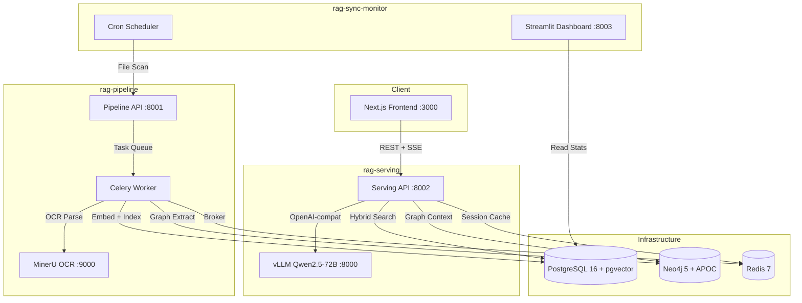

# On-Premise RAG-LLM 사내 AI 어시스턴트 v2

사내 문서(PDF, DOCX, XLSX, PPTX, 이미지)를 기반으로 **ChatGPT/Claude 수준의 UX**를 제공하는 완전 온프레미스 AI 어시스턴트.
외부 API(OpenAI, Anthropic 등) 미사용 — 보안 최우선. 3-프로젝트 모노레포 구조.

---

## 아키텍처



---

## 기술 스택

| 레이어 | 기술 | 비고 |
|--------|------|------|
| Frontend | Next.js 14 (App Router, TypeScript, Tailwind) | 채팅 UI, 로그인, 관리자 |
| Backend | FastAPI (Python 3.11, sync SQLAlchemy) | rag-serving + rag-pipeline |
| LLM | vLLM + Qwen2.5-72B-Instruct-AWQ | OpenAI-compatible API |
| Embedding | BAAI/bge-m3 (1024-dim) | Dense + Sparse 지원 |
| Reranker | BAAI/bge-reranker-v2-m3 | Cross-encoder |
| Vector + RDBMS | PostgreSQL 16 + pgvector (HNSW) + tsvector | Hybrid Search (Dense + Sparse + RRF) |
| Graph DB | Neo4j 5 + APOC | GraphRAG (NER + 2-hop context) |
| Task Queue | Celery + Redis 7 | 비동기 파이프라인 처리 |
| OCR | MinerU (RAG-Anything) | PDF/이미지 파싱 |
| Monitoring | Streamlit | 동기화/처리 대시보드 |
| Container | Docker Compose | 모노레포 오케스트레이션 |

---

## 모노레포 구조

```
llm_again/
├── shared/                          # 공유 모듈
│   ├── sql/init.sql                 #   PostgreSQL DDL (27 테이블)
│   ├── models/
│   │   ├── orm.py                   #   SQLAlchemy ORM 모델
│   │   └── registry.py             #   ML 모델 레지스트리
│   ├── config.py                    #   Pydantic 공통 설정
│   └── db.py                        #   DB 연결 헬퍼
│
├── rag-pipeline/                    # 문서 수집/파싱/임베딩 파이프라인
│   ├── api/main.py                  #   Pipeline API (FastAPI)
│   ├── pipeline/
│   │   ├── scanner.py               #   파일 시스템 스캐너
│   │   ├── parser.py                #   MinerU 파서
│   │   ├── chunker.py               #   Hybrid 청킹
│   │   ├── embedder.py              #   BGE-M3 임베딩
│   │   ├── indexer.py               #   pgvector 인덱싱
│   │   ├── graph_extractor.py       #   Neo4j 엔티티 추출
│   │   └── orchestrator.py          #   파이프라인 오케스트레이터
│   ├── tasks/
│   │   ├── celery_app.py            #   Celery 앱 설정
│   │   └── pipeline_tasks.py        #   비동기 처리 태스크
│   └── config.py                    #   Pipeline 설정
│
├── rag-serving/                     # RAG 질의응답 + 인증 + 관리
│   ├── api/
│   │   ├── main.py                  #   Serving API (FastAPI + CORS)
│   │   ├── routers/
│   │   │   ├── auth.py              #   인증 (JWT login/refresh/logout)
│   │   │   ├── chat.py              #   채팅 (SSE 스트리밍)
│   │   │   └── admin.py             #   관리자 (사용자/문서/설정)
│   │   ├── auth/                    #   JWT + bcrypt 인증 모듈
│   │   └── rag/
│   │       ├── retriever.py         #   Hybrid Search (Dense + Sparse + RRF)
│   │       ├── reranker.py          #   BGE-reranker-v2-m3
│   │       ├── graph_retriever.py   #   Neo4j Graph Context
│   │       └── generator.py         #   vLLM SSE 스트리밍
│   ├── admin/index.html             #   관리자 대시보드 (Vanilla HTML)
│   ├── vllm/start_vllm.sh          #   vLLM 시작 스크립트
│   └── config.py                    #   Serving 설정
│
├── rag-sync-monitor/                # 파일/사용자 동기화 + 모니터링
│   ├── sync/
│   │   ├── file_syncer.py           #   파일 동기화
│   │   ├── user_syncer.py           #   사용자 동기화
│   │   └── change_detector.py       #   변경 감지
│   ├── trigger/
│   │   └── pipeline_trigger.py      #   rag-pipeline API 호출
│   ├── scheduler/cron_sync.py       #   APScheduler 크론
│   └── dashboard/app.py             #   Streamlit 대시보드
│
├── frontend/                        # Next.js 프론트엔드
│   ├── app/                         #   App Router (login, chat, admin)
│   ├── components/                  #   React 컴포넌트
│   └── lib/                         #   API 클라이언트, 인증 상태
│
├── app/                             # (v1 레거시, 참조용)
├── docker-compose.yml               # 루트 오케스트레이션
├── docker-compose.base.yml          # 인프라 서비스 (PG, Neo4j, Redis)
├── Makefile                         # 편의 명령어
└── .env.example                     # 환경변수 템플릿
```

---

## 포트 매핑

| 서비스 | 컨테이너 이름 | 포트 | 설명 |
|--------|--------------|------|------|
| `vllm-server` | rag-vllm | 8000 | vLLM OpenAI-compatible API (GPU) |
| `pipeline-api` | rag-pipeline-api | 8001 | 문서 처리 파이프라인 API |
| `serving-api` | rag-serving-api | 8002 | RAG 질의응답 + 인증 API |
| `sync-dashboard` | rag-sync-dashboard | 8003 | Streamlit 모니터링 대시보드 |
| `frontend` | rag-frontend | 3000 | Next.js UI |
| `postgres` | rag-postgres | 5432 | PostgreSQL 16 + pgvector |
| `neo4j` | rag-neo4j | 7474 / 7687 | Neo4j Browser / Bolt |
| `redis` | rag-redis | 6379 | Redis (Celery 브로커) |
| `mineru-api` | rag-mineru-api | 9000 | MinerU OCR/PDF 파싱 |

---

## 빠른 시작

### 1. 환경 설정

```bash
git clone <repository-url>
cd llm_again
cp .env.example .env
```

`.env` 필수 설정:

```ini
# PostgreSQL
POSTGRES_PASSWORD=your_secure_password

# JWT (반드시 변경 -- 최소 32자)
JWT_SECRET=your-very-secret-key-minimum-32-characters

# Neo4j
NEO4J_PASSWORD=your_neo4j_password

# 문서 감시 폴더
DOC_WATCH_DIR=/path/to/your/documents
```

### 2. 서비스 실행

```bash
# 전체 서비스 (GPU 없이 -- 개발/전처리)
docker compose up -d

# GPU 포함 (vLLM)
docker compose --profile gpu up -d

# 상태 확인
docker compose ps
```

### 3. 첫 관리자 계정 생성

```bash
docker compose exec serving-api python3 -c "
from rag_serving.api.auth.password import hash_password
from shared.models.orm import User
from shared.db import get_session
with get_session() as s:
    u = User(
        pwd=hash_password('your_password'),
        usr_name='관리자',
        email='admin@company.com',
        dept_id=1,
        role_id=1
    )
    s.add(u)
print('관리자 계정 생성 완료')
"
```

### 4. 접속

| URL | 서비스 |
|-----|--------|
| http://localhost:3000 | 채팅 UI (로그인 후 사용) |
| http://localhost:8002/docs | Serving API Swagger |
| http://localhost:8001/docs | Pipeline API Swagger |
| http://localhost:8003 | Sync/Monitor 대시보드 |
| http://localhost:7474 | Neo4j Browser |

---

## 서브 프로젝트

### rag-pipeline

문서 수집/파싱/청킹/임베딩/인덱싱 파이프라인. MinerU로 OCR 파싱 후 BGE-M3 임베딩, pgvector + Neo4j에 인덱싱. Celery 비동기 처리.

**자세한 내용:** [rag-pipeline/README.md](rag-pipeline/README.md)

### rag-serving

RAG 질의응답 + JWT 인증 + 관리자 API. Hybrid Search (Dense + Sparse + RRF) + Reranker + GraphRAG + vLLM SSE 스트리밍.

**자세한 내용:** [rag-serving/README.md](rag-serving/README.md)

### rag-sync-monitor

파일/사용자 동기화 스케줄러 + Streamlit 모니터링 대시보드. 주기적 파일 스캔 후 변경 감지, rag-pipeline API로 처리 트리거.

**자세한 내용:** [rag-sync-monitor/README.md](rag-sync-monitor/README.md)

---

## 개발 환경 설정

### 로컬 개발 (Docker 없이)

```bash
# Python 가상환경
python3.11 -m venv .venv
source .venv/bin/activate
pip install -r requirements.txt

# 인프라만 Docker로 실행
docker compose -f docker-compose.base.yml up -d

# 각 서비스 개별 실행
uvicorn rag_pipeline.api.main:app --port 8001 --reload
uvicorn rag_serving.api.main:app --port 8002 --reload
streamlit run rag_sync_monitor/dashboard/app.py --server.port 8003

# Frontend
cd frontend && npm install && npm run dev
```

### vLLM 모델 다운로드 (GPU 서버)

```bash
huggingface-cli download Qwen/Qwen2.5-72B-Instruct-AWQ \
  --local-dir /data/models/vllm/Qwen2.5-72B-Instruct-AWQ

# 멀티 GPU 설정 (.env)
VLLM_TENSOR_PARALLEL=4
VLLM_GPU_COUNT=4
```

---

## 환경변수 레퍼런스

### 공통 (shared)

| 변수 | 기본값 | 설명 |
|------|--------|------|
| `POSTGRES_HOST` | `postgres` | PostgreSQL 호스트 |
| `POSTGRES_PORT` | `5432` | PostgreSQL 포트 |
| `POSTGRES_DB` | `rag_system` | 데이터베이스 이름 |
| `POSTGRES_USER` | `admin` | DB 사용자 |
| `POSTGRES_PASSWORD` | `changeme` | DB 비밀번호 **(변경 필수)** |
| `NEO4J_URL` | `bolt://neo4j:7687` | Neo4j Bolt URL |
| `NEO4J_USER` | `neo4j` | Neo4j 사용자 |
| `NEO4J_PASSWORD` | `changeme` | Neo4j 비밀번호 **(변경 필수)** |
| `REDIS_URL` | `redis://redis:6379/0` | Redis URL |
| `JWT_SECRET` | *(변경 필수)* | JWT 서명 키 (32자+) |
| `JWT_ACCESS_EXPIRE_MINUTES` | `15` | Access token 만료 (분) |
| `JWT_REFRESH_EXPIRE_DAYS` | `7` | Refresh token 만료 (일) |
| `EMBEDDING_MODEL_NAME` | `BAAI/bge-m3` | 임베딩 모델 |
| `EMBEDDING_MODEL_DIR` | `/models/embedding` | 임베딩 모델 캐시 경로 |
| `EMBEDDING_DEVICE` | `cuda` | 디바이스 (cpu/cuda) |
| `RERANKER_MODEL_NAME` | `BAAI/bge-reranker-v2-m3` | 리랭커 모델 |
| `RERANKER_MODEL_DIR` | `/models/reranker` | 리랭커 모델 경로 |
| `HF_TOKEN` | - | HuggingFace 토큰 (private 모델) |

### rag-pipeline

| 변수 | 기본값 | 설명 |
|------|--------|------|
| `MINERU_API_URL` | `http://mineru-api:9000` | MinerU API URL |
| `MINERU_BACKEND` | `hybrid-auto-engine` | MinerU 백엔드 |
| `MINERU_LANG` | `korean` | OCR 언어 |
| `SOURCE_SCAN_PATHS` | `/mnt/nas/documents` | 문서 스캔 경로 |
| `CHUNK_STRATEGY` | `hybrid` | 청킹 전략 |
| `CHUNK_SIZE` | `512` | 청크 최대 토큰 수 |
| `CHUNK_OVERLAP` | `50` | 청크 오버랩 토큰 |
| `DOC_WATCH_DIR` | `/data/documents` | 문서 감시 폴더 (호스트) |
| `IMAGE_STORE_DIR` | `/data/images` | 이미지 저장 경로 |

### rag-serving

| 변수 | 기본값 | 설명 |
|------|--------|------|
| `VLLM_BASE_URL` | `http://vllm-server:8000/v1` | vLLM API URL |
| `VLLM_MODEL_NAME` | `qwen2.5-72b` | 모델 served name |
| `VLLM_MODEL` | `Qwen/Qwen2.5-72B-Instruct-AWQ` | HuggingFace 모델 ID |
| `VLLM_TENSOR_PARALLEL` | `1` | GPU 병렬 수 |
| `VLLM_GPU_COUNT` | `1` | GPU 개수 |
| `VLLM_GPU_MEM_UTIL` | `0.90` | GPU 메모리 사용률 |
| `VLLM_MAX_MODEL_LEN` | `32768` | 최대 컨텍스트 길이 |
| `GOOGLE_API_KEY` | - | Google Custom Search API 키 |
| `GOOGLE_CX` | - | Google 커스텀 검색 엔진 ID |
| `WEB_SEARCH_ENABLED` | `true` | 웹 검색 활성화 |

### rag-sync-monitor

| 변수 | 기본값 | 설명 |
|------|--------|------|
| `SYNC_INTERVAL_MINUTES` | `30` | 동기화 주기 (분) |
| `DEFAULT_DEPT_ID` | `1` | 신규 문서 기본 부서 ID |
| `DEFAULT_ROLE_ID` | `3` | 신규 문서 기본 역할 ID |
| `PIPELINE_API_URL` | `http://rag-pipeline:8001` | Pipeline API URL |

---

## 문서

| 문서 | 설명 |
|------|------|
| [docs/erd.md](docs/erd.md) | ERD 다이어그램 (27 테이블) |
| [docs/flowcharts.md](docs/flowcharts.md) | 시스템 흐름도 |
| [docs/plans/](docs/plans/) | 설계 및 구현 계획 |
