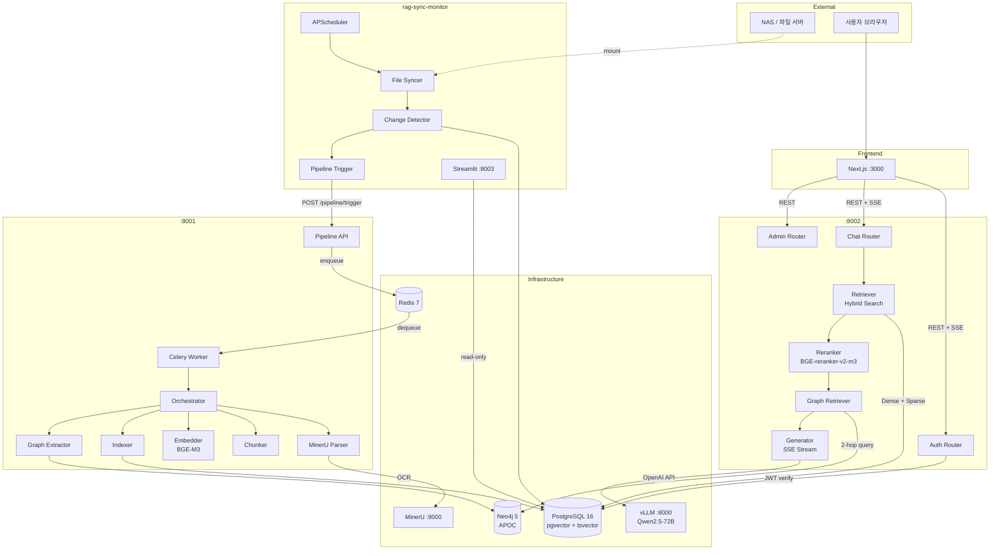
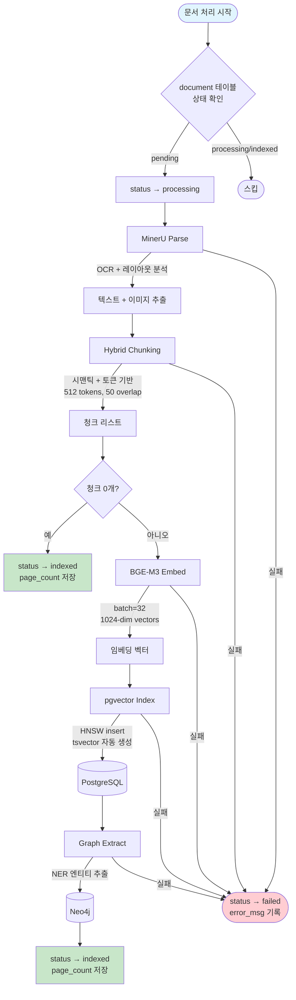
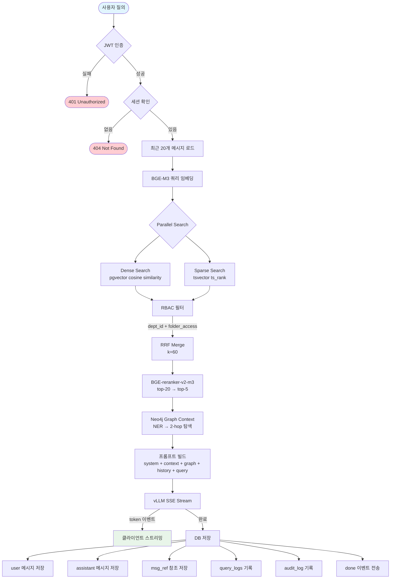
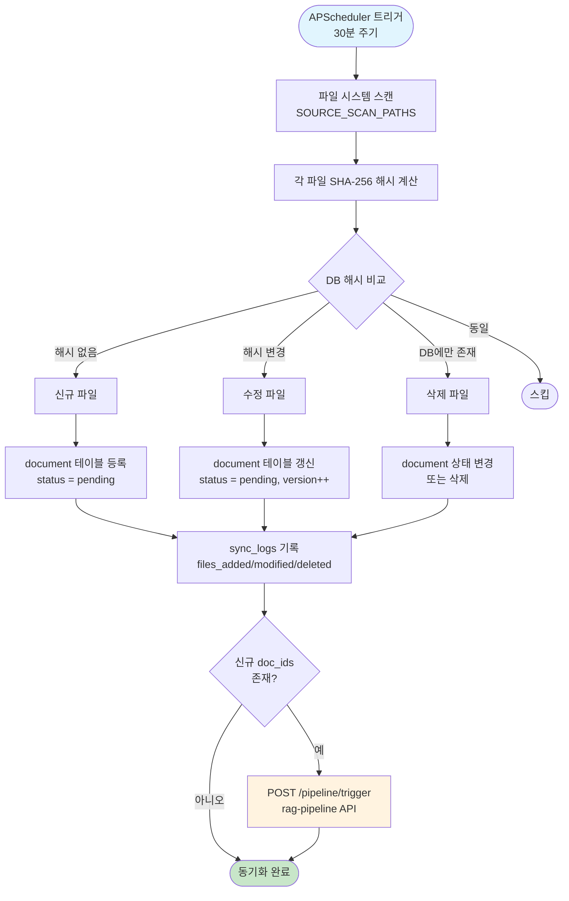

# System Flowcharts

시스템 전체 흐름도 모음.

---

## 1. 전체 시스템 아키텍처

서비스 간 상호작용 전체 흐름.



---

## 2. 문서 인제스트 파이프라인

`rag-pipeline` 문서 처리 상세 흐름.



### 각 단계별 pipeline_logs 기록

| stage | 설명 |
|-------|------|
| `mineru_parse` | MinerU OCR 파싱 (pages 수 기록) |
| `chunk` | 텍스트 청킹 (chunk 수 기록) |
| `embed` | BGE-M3 임베딩 |
| `index` | pgvector 인덱싱 |
| `graph_extract` | Neo4j 엔티티 추출 (entity 수 기록) |

---

## 3. RAG 질의 흐름

`rag-serving` 채팅 질의응답 상세 흐름.



### SSE 이벤트 순서

```
1. data: {"type": "token", "content": "..."} (N회 반복)
2. data: {"type": "references", "refs": [...]}
3. data: {"type": "done", "msg_id": 42}
```

---

## 4. 파일 동기화 흐름

`rag-sync-monitor` 파일 동기화 상세 흐름.



---

## 5. 인증 흐름

JWT 기반 인증/인가 상세 흐름.

```mermaid
flowchart TD
    subgraph Login
        L_START([POST /auth/login]) --> L_CHECK{이메일 조회}
        L_CHECK -->|없음| L_ERR([401 Invalid credentials])
        L_CHECK -->|있음| L_LOCK{계정 잠금?}
        L_LOCK -->|잠금| L_ERR_LOCK([403 Account locked])
        L_LOCK -->|정상| L_PWD{비밀번호 검증}
        L_PWD -->|불일치| L_FAIL[failure++ 증가]
        L_FAIL --> L_FIVE{failure >= 5?}
        L_FIVE -->|예| L_DO_LOCK[locked_until = now + 30분]
        L_FIVE -->|아니오| L_ERR
        L_DO_LOCK --> L_ERR
        L_PWD -->|일치| L_RESET[failure = 0<br/>last_login = now]
        L_RESET --> L_TOKEN[Access Token 생성 (15분)<br/>Refresh Token 생성 (7일)]
        L_TOKEN --> L_SAVE[refresh_token 해시 DB 저장]
        L_SAVE --> L_RESP([200 TokenResponse])
    end

    subgraph Refresh
        R_START([POST /auth/refresh]) --> R_DECODE{refresh token 디코드}
        R_DECODE -->|만료/무효| R_ERR([401 Invalid token])
        R_DECODE -->|유효| R_DB{DB 해시 확인<br/>revoked = false?}
        R_DB -->|없음/revoked| R_ERR
        R_DB -->|유효| R_NEW[새 Access Token 발급]
        R_NEW --> R_RESP([200 AccessTokenResponse])
    end

    subgraph Protected API
        P_START([Bearer Token 헤더]) --> P_DECODE{access token 디코드}
        P_DECODE -->|만료/무효| P_ERR([401 Unauthorized])
        P_DECODE -->|유효| P_USER[DB에서 사용자 조회]
        P_USER --> P_ACTIVE{is_active?}
        P_ACTIVE -->|비활성| P_ERR
        P_ACTIVE -->|활성| P_OK([인증 완료 → 요청 처리])
    end

    style L_RESP fill:#c8e6c9
    style R_RESP fill:#c8e6c9
    style P_OK fill:#c8e6c9
    style L_ERR fill:#ffcdd2
    style L_ERR_LOCK fill:#ffcdd2
    style R_ERR fill:#ffcdd2
    style P_ERR fill:#ffcdd2
```

### 토큰 정책

| 항목 | 값 |
|------|-----|
| Access Token 만료 | 15분 |
| Refresh Token 만료 | 7일 |
| 알고리즘 | HS256 |
| 로그인 실패 잠금 | 5회 실패 → 30분 잠금 |
| Refresh Token 저장 | DB 해시 저장 (revoke 지원) |
