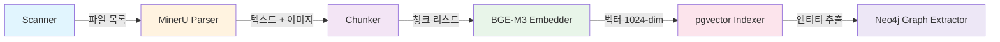

# rag-pipeline

문서 수집/파싱/청킹/임베딩/인덱싱 파이프라인.

NAS 또는 업로드된 문서를 MinerU로 OCR 파싱, Hybrid 청킹, BGE-M3 임베딩 후 PostgreSQL(pgvector) + Neo4j에 인덱싱합니다.
Celery 비동기 태스크로 대량 문서를 병렬 처리합니다.

---

## 파이프라인 흐름



### 단계별 설명

| 단계 | 모듈 | 설명 |
|------|------|------|
| **Scanner** | `pipeline/scanner.py` | 파일 시스템 스캔, 해시 기반 중복 감지 |
| **Parser** | `pipeline/parser.py` | MinerU API로 OCR 파싱 (PDF, DOCX, XLSX, PPTX, 이미지) |
| **Chunker** | `pipeline/chunker.py` | Hybrid 청킹 (시맨틱 + 토큰 기반, 512 토큰, 50 오버랩) |
| **Embedder** | `pipeline/embedder.py` | BAAI/bge-m3 임베딩 (1024-dim, batch=32) |
| **Indexer** | `pipeline/indexer.py` | pgvector HNSW 인덱스 + tsvector GIN 인덱스 저장 |
| **Graph Extractor** | `pipeline/graph_extractor.py` | NER 엔티티 추출, Neo4j 노드/관계 생성 |

---

## API 엔드포인트

**Base URL:** `http://localhost:8001`

| 엔드포인트 | 메서드 | 설명 |
|-----------|--------|------|
| `/pipeline/trigger` | POST | 지정 doc_ids 파이프라인 실행 |
| `/pipeline/trigger/full` | POST | 전체 문서 재처리 |
| `/pipeline/status/{doc_id}` | GET | 문서 파이프라인 상태 조회 (단계별 로그) |
| `/health` | GET | 헬스 체크 |

### 사용 예시

```bash
# 특정 문서 처리 트리거
curl -X POST http://localhost:8001/pipeline/trigger \
  -H "Content-Type: application/json" \
  -d '{"doc_ids": [1, 2, 3]}'

# 파이프라인 상태 확인
curl http://localhost:8001/pipeline/status/1
```

---

## Celery 태스크

| 태스크 | 큐 | 설명 |
|--------|-----|------|
| `process_document_task` | `pipeline` | 단일 문서 전체 파이프라인 (parse → chunk → embed → index → graph) |
| `process_batch_task` | `pipeline` | 다수 문서 배치 처리 (각 문서별 `process_document_task` 호출) |

Worker 설정:
- **Concurrency:** 2 (GPU 메모리 고려)
- **Queue:** `pipeline`

---

## 설정

`rag-pipeline/config.py` (`PipelineSettings`, `.env`에서 로드):

| 변수 | 기본값 | 설명 |
|------|--------|------|
| `MINERU_API_URL` | `http://mineru-api:9000` | MinerU API URL |
| `MINERU_BACKEND` | `hybrid-auto-engine` | MinerU 백엔드 |
| `MINERU_LANG` | `korean` | OCR 언어 |
| `SOURCE_SCAN_PATHS` | `/mnt/nas/documents` | 문서 스캔 경로 |
| `CHUNK_STRATEGY` | `hybrid` | 청킹 전략 |
| `CHUNK_SIZE` | `512` | 청크 최대 토큰 수 |
| `CHUNK_OVERLAP` | `50` | 청크 오버랩 |
| `CHUNK_MIN_SECTION_TOKENS` | `80` | 최소 섹션 토큰 수 |
| `ENABLE_IMAGE_EMBEDDING` | `true` | 이미지 임베딩 활성화 |
| `IMAGE_STORE_DIR` | `/data/images` | 이미지 저장 경로 |
| `EMBEDDING_MODEL_NAME` | `BAAI/bge-m3` | 임베딩 모델 |
| `EMBEDDING_DEVICE` | `cuda` | 디바이스 |
| `EMBEDDING_BATCH_SIZE` | `32` | 배치 크기 |

---

## Docker

```bash
# 루트에서 전체 실행 (pipeline 포함)
docker compose up -d pipeline-api pipeline-worker mineru-api

# Worker 로그 확인
docker compose logs -f pipeline-worker

# Worker 스케일링
docker compose up -d --scale pipeline-worker=3
```

### 볼륨 마운트

| 호스트 경로 | 컨테이너 경로 | 설명 |
|------------|--------------|------|
| `$DOC_WATCH_DIR` | `/data/documents` | 문서 폴더 (읽기 전용) |
| `$EMBEDDING_MODEL_DIR` | `/models/embedding` | 임베딩 모델 캐시 |
| `$IMAGE_STORE_DIR` | `/data/images` | 추출 이미지 저장 |

### GPU 요구사항

- `pipeline-worker`: NVIDIA GPU 1개 (임베딩용)
- `mineru-api`: NVIDIA GPU 1개 (OCR용)
