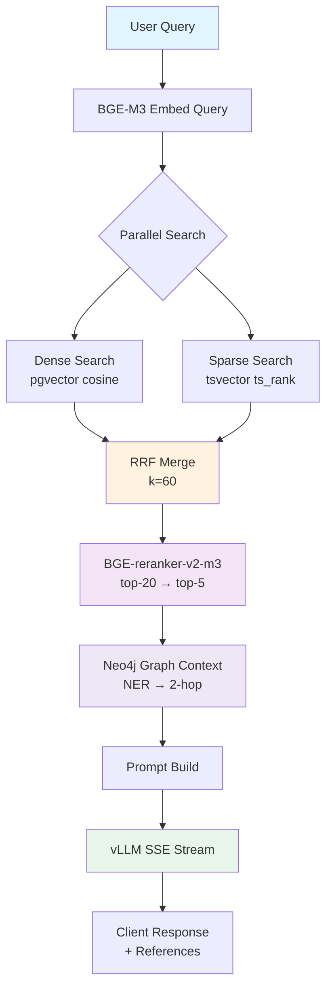

# rag-serving

RAG 질의응답 + JWT 인증 + 관리자 API.

사용자 질의를 Hybrid Search (Dense + Sparse + RRF) → Reranker → GraphRAG → vLLM SSE 스트리밍으로 처리합니다.
Department 기반 RBAC으로 접근 가능한 문서만 검색합니다.

---

## 질의 흐름



### RBAC 필터링

검색 시 사용자 접근 권한에 따라 필터링:
1. `doc.dept_id = user.dept_id` (같은 부서 문서)
2. `folder_access` 테이블의 추가 접근 권한 (부서 외 문서)

---

## API 엔드포인트

**Base URL:** `http://localhost:8002`

### 인증 (`/api/v1/auth`)

| 엔드포인트 | 메서드 | 인증 | 설명 |
|-----------|--------|------|------|
| `/api/v1/auth/login` | POST | - | 로그인 → access/refresh token |
| `/api/v1/auth/refresh` | POST | - | access token 갱신 |
| `/api/v1/auth/logout` | POST | Bearer | refresh token 무효화 |
| `/api/v1/auth/me` | GET | Bearer | 현재 사용자 정보 |

### 채팅 (`/api/v1/chat`)

| 엔드포인트 | 메서드 | 인증 | 설명 |
|-----------|--------|------|------|
| `/api/v1/chat/sessions` | POST | Bearer | 새 세션 생성 |
| `/api/v1/chat/sessions` | GET | Bearer | 내 세션 목록 |
| `/api/v1/chat/sessions/{id}/stream` | POST | Bearer | **SSE 스트리밍 답변** |
| `/api/v1/chat/sessions/{id}/messages` | GET | Bearer | 대화 히스토리 |
| `/api/v1/chat/sessions/{id}` | DELETE | Bearer | 세션 삭제 |

#### SSE 스트리밍 이벤트

```
data: {"type": "token", "content": "답변"}
data: {"type": "references", "refs": [{"doc_id": 1, "file_name": "...", "page": 3, "score": 0.85}]}
data: {"type": "done", "msg_id": 42}
data: {"type": "error", "message": "..."}
```

### 관리자 (`/api/v1/admin`)

| 엔드포인트 | 메서드 | 인증 | 설명 |
|-----------|--------|------|------|
| `/api/v1/admin/users` | GET | Admin | 사용자 목록 |
| `/api/v1/admin/users` | POST | Admin | 사용자 생성 |
| `/api/v1/admin/users/{id}` | PUT | Admin | 사용자 수정 (부서/역할/활성화) |
| `/api/v1/admin/stats` | GET | Admin | 시스템 통계 |
| `/api/v1/admin/llm-config` | GET/PUT | Admin | LLM 설정 관리 |
| `/api/v1/admin/audit-logs` | GET | Admin | 감사 로그 조회 |

### 기타

| 엔드포인트 | 메서드 | 설명 |
|-----------|--------|------|
| `/health` | GET | 헬스 체크 |
| `/admin/` | GET | 관리자 대시보드 (Vanilla HTML) |
| `/docs` | GET | Swagger UI |

---

## 인증 방식

- **JWT (HS256)**: Access 15분 / Refresh 7일
- 로그인 실패 5회 → 계정 잠금 (30분)
- Refresh token은 DB에 해시 저장, revoke 지원
- 모든 API 요청 audit_log 기록

---

## 설정

`rag-serving/config.py` (`ServingSettings`, `.env`에서 로드):

| 변수 | 기본값 | 설명 |
|------|--------|------|
| `VLLM_BASE_URL` | `http://vllm-server:8000/v1` | vLLM API URL |
| `VLLM_MODEL_NAME` | `qwen2.5-72b` | 모델 served name |
| `WEB_SEARCH_ENABLED` | `true` | 웹 검색 활성화 |
| `GOOGLE_API_KEY` | - | Google Custom Search API 키 |
| `GOOGLE_CX` | - | Google 커스텀 검색 엔진 ID |
| `SERVING_API_PORT` | `8002` | API 포트 |
| `JWT_SECRET` | *(변경 필수)* | JWT 서명 키 (32자+) |
| `JWT_ACCESS_EXPIRE_MINUTES` | `15` | Access token 만료 |
| `JWT_REFRESH_EXPIRE_DAYS` | `7` | Refresh token 만료 |
| `EMBEDDING_MODEL_NAME` | `BAAI/bge-m3` | 쿼리 임베딩 모델 |
| `RERANKER_MODEL_NAME` | `BAAI/bge-reranker-v2-m3` | 리랭커 모델 |

---

## Docker

```bash
# 루트에서 실행
docker compose up -d serving-api frontend

# vLLM 포함 (GPU 필요)
docker compose --profile gpu up -d vllm-server serving-api frontend

# API 로그
docker compose logs -f serving-api
```

### 볼륨 마운트

| 호스트 경로 | 컨테이너 경로 | 설명 |
|------------|--------------|------|
| `$EMBEDDING_MODEL_DIR` | `/models/embedding` | 쿼리 임베딩 모델 |
| `$RERANKER_MODEL_DIR` | `/models/reranker` | 리랭커 모델 |
| `$VLLM_MODEL_DIR` | `/root/.cache/huggingface` | vLLM 모델 (GPU 서비스) |

### GPU 요구사항

- `serving-api`: NVIDIA GPU 1개 (임베딩 + 리랭커)
- `vllm-server`: NVIDIA GPU 1+ (LLM 추론, `VLLM_GPU_COUNT`로 설정)

### vLLM 모델 선택 (HB200 단일 GPU 기준)

| 모델 | 메모리 | 성능 | 비고 |
|------|--------|------|------|
| `Qwen/Qwen2.5-72B-Instruct-AWQ` | ~40GB | 최고 | **운영 권장** |
| `Qwen/Qwen2.5-32B-Instruct` | ~64GB | 우수 | 고정밀도 |
| `Qwen/Qwen3-30B-A3B` | ~60GB | 우수 | MoE 효율형 |
