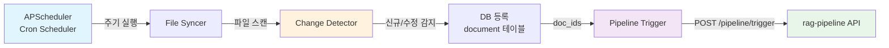

# rag-sync-monitor

파일/사용자 동기화 + 모니터링 대시보드.

NAS 등 외부 파일 소스를 주기적으로 스캔하여 신규/수정/삭제된 문서를 감지하고,
rag-pipeline API를 통해 자동으로 처리를 트리거합니다.
Streamlit 대시보드로 동기화 이력, 문서 현황, 파이프라인 오류를 모니터링합니다.

---

## 동기화 흐름



### 동기화 프로세스

1. **APScheduler** 가 설정된 주기(기본 30분)로 `run_file_sync()` 실행
2. **File Syncer** 가 `SOURCE_SCAN_PATHS` 디렉토리를 재귀 스캔
3. **Change Detector** 가 파일 해시를 DB 기존 해시와 비교하여 신규/수정/삭제 감지
4. 신규/수정 문서를 `document` 테이블에 `pending` 상태로 등록
5. **Pipeline Trigger** 가 `rag-pipeline` API에 처리 요청
6. 동기화 결과를 `sync_logs` 테이블에 기록

---

## 모듈

| 모듈 | 파일 | 설명 |
|------|------|------|
| **Cron Scheduler** | `scheduler/cron_sync.py` | APScheduler 기반 주기적 동기화 실행 |
| **File Syncer** | `sync/file_syncer.py` | 파일 시스템 스캔 + DB 등록 |
| **User Syncer** | `sync/user_syncer.py` | 사용자 정보 동기화 (LDAP 등) |
| **Change Detector** | `sync/change_detector.py` | 해시 기반 파일 변경 감지 |
| **Pipeline Trigger** | `trigger/pipeline_trigger.py` | rag-pipeline API 호출 |
| **Dashboard** | `dashboard/app.py` | Streamlit 모니터링 UI |

---

## Streamlit 대시보드

**URL:** `http://localhost:8003`

### 페이지

| 페이지 | 설명 |
|--------|------|
| **Users** | 사용자 목록 (부서별 필터링) |
| **Files** | 문서 목록 (상태별 필터링: pending/processing/indexed/failed) |
| **Sync History** | 동기화 이력 + 추가/수정/삭제 건수 차트 |
| **File Status** | 문서 상태 분포 (막대 차트) |
| **Department** | 부서별 인덱싱 완료 문서 수 |
| **Errors** | 파이프라인 오류 목록 (stage, error_message) |

---

## 설정

환경변수 (`.env`에서 로드):

| 변수 | 기본값 | 설명 |
|------|--------|------|
| `SYNC_INTERVAL_MINUTES` | `30` | 동기화 주기 (분) |
| `SOURCE_SCAN_PATHS` | `/mnt/nas/documents` | 스캔 대상 경로 |
| `DEFAULT_DEPT_ID` | `1` | 신규 문서 기본 부서 ID |
| `DEFAULT_ROLE_ID` | `3` | 신규 문서 기본 역할 ID |
| `PIPELINE_API_URL` | `http://rag-pipeline:8001` | Pipeline API URL |
| `POSTGRES_*` | *(shared 설정)* | PostgreSQL 연결 정보 |

---

## Docker

```bash
# 루트에서 실행
docker compose up -d sync-scheduler sync-dashboard

# 스케줄러 로그
docker compose logs -f sync-scheduler

# 대시보드 로그
docker compose logs -f sync-dashboard
```

### 볼륨 마운트

| 호스트 경로 | 컨테이너 경로 | 설명 |
|------------|--------------|------|
| `$DOC_WATCH_DIR` | `/mnt/nas/documents` | 문서 스캔 폴더 (읽기 전용) |

### 참고

- 스케줄러는 시작 시 즉시 한 번 동기화를 실행한 후 주기적으로 반복합니다.
- 대시보드는 PostgreSQL에 직접 연결하여 읽기 전용으로 데이터를 조회합니다.
- GPU 불필요 (CPU만으로 동작).
